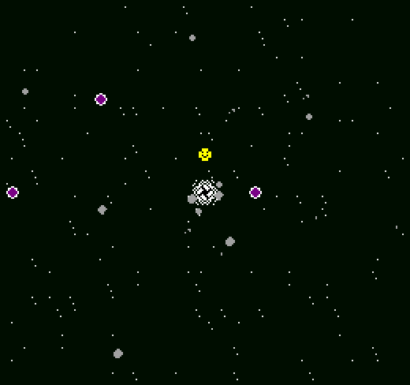

# Black Hole Escape!

Author: William Ozeas

Design: Black Hole Escape! is a kind of bullet hell with 8 constrained directions. As you get closer to escaping the
black hole's pull, you get closer to the spawn point of the projectiles, meaning the game gets naturally harder as it progresses.

Screen Shot:

How Your Asset Pipeline Works:

My asset pipeline (AssetPipeline.cpp) takes all files in assets/tiles and reads them into a binary file. These assets must use a color palette
of transparency, #ff0000, #00ff00, and #0000ff, because the game uses hard-coded palettes, some of which change during the 
game. Each pixel is then marked as one of the four colors using the two bit maps.

The second type of asset is a "projectile map" which is a 8x360 png. The asset pipeline converts each row of the png into a single 8-bit integer, 
where each non-transparent pixel is a 1 and a transparent pixel is a 0. This is then converted to a map in-game, where every
0.25 seconds, a row is read and the associated projectiles are spawned. Each bit corresponds to a direction, starting with up
and going clockwise.

All source files are under the assets/ directory.

How To Play:

Use the arrow keys to move in a direction. Dodge incoming projectiles! Survive for 90 seconds to win.

This game was built with [NEST](NEST.md).

